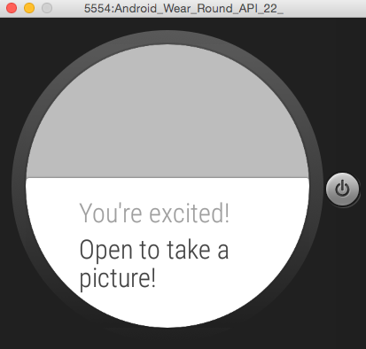

# Smartwatch Excitement Tracker
Example of an Android Mobile and Wear app that helps a user document exciting moments!

- ListenerService detects large changes in smartwatch accelerometer readings (e.g. someone jumping up and down)
- Smartwatch generates a notification on their wrist
- User can open the app on their Mobile, take a picture, and post it to Twitter
- App sends another similar picture to the Wear device

Date authored: July 10, 2015

## Demo video:

## Interface screenshots:

